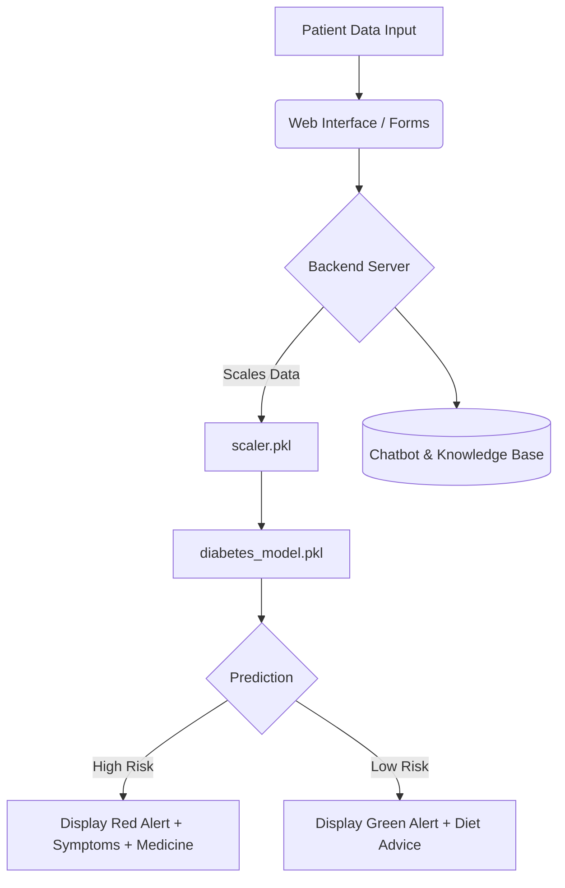

# 🩺 Healthcare Disease Prediction (Diabetes Risk Analyzer)


> **Live Preview (Professional Edition):** [Click here to view live site!](https://healthcare-disease-prediction.vercel.app) *(Update with your specific Vercel URL)*
> **Live Preview (Classic Streamlit Version):** [Click here to view live site!](https://healthcare-disease-prediction.streamlit.app/) *(Update with your specific Streamlit URL)*

Welcome to the **Healthcare Disease Prediction** repository! This project is an end-to-end Machine Learning web application designed to predict the risk of early-stage diabetes based on patient diagnostic information. 

Whether you are a beginner looking to understand machine learning pipelines or an experienced developer wanting to see a professional web app integration, this guide will walk you through EVERYTHING step-by-step!

---

## 🏗️ Project Architecture & Flowchart

The system follows a standard Machine Learning pipeline: it takes user inputs, scales them based on historical training data, passes them through a trained model, and displays the risk alongside custom medical advice.



---

## 🧠 The Machine Learning Models

The backbone of this project lies in the `model/` folder.
*   **The Classifier (`diabetes_model.pkl`)**: This is a robust machine learning algorithm (often a Random Forest or XGBoost model) trained on extensive medical datasets (like the Pima Indians Diabetes Database). It classifies data points as either `1` (Diabetic) or `0` (Non-Diabetic).
*   **The Scaler (`scaler.pkl`)**: Health data has vastly different scales (e.g., Insulin can be up to 800, whereas Diabetes Pedigree is often below 1.0). The scaler standardizes these inputs so the model doesn't mathematically favor large numbers over small ones.
*   **The Columns (`training_columns.pkl`)**: This ensures our web app sends the features (Glucose, BMI, Age, etc.) in the exact sequence the model expects them!

---

## 🚀 Beginner's Step-by-Step Guide

Want to run this professional web application on your own computer? Follow these simple steps.

### Step 1: Install Python
Ensure you have Python installed on your computer. You can download it from [python.org](https://www.python.org/downloads/).
*(Tip: Check the box that says "Add Python to PATH" during installation).*

### Step 2: Download this Project
Clone this repository to your local machine using git, or just download the ZIP file and extract it.
```bash
git clone https://github.com/Vedantsg23/Healthcare-Disease-Prediction.git
cd Healthcare-Disease-Prediction
```

### Step 3: Install the Required Libraries
Machine Learning projects require specific Python libraries holding the tools we need (like `pandas`, `scikit-learn`, and `Flask`). We install all of these at once using the `requirements.txt` file.

Open your computer's terminal (or command prompt), make sure you are inside the project folder, and run:
```bash
pip install -r requirements.txt
```

### Step 4: Run the Application!
This project contains TWO fully functional architectures!

**To run the massively upgraded Flask/HTML Architecture Locally:**
```bash
python flask_app.py
```
*   You will see an output saying: `Running on http://127.0.0.1:5000`
*   **Open your browser** (Chrome, Safari, Edge) and type `http://127.0.0.1:5000` in the address bar to view the professional web application.

**To run the classic Streamlit Architecture (Cloud Deployment Ready):**
```bash
streamlit run app.py
```
*   This will automatically boot up the Streamlit dashboard on your local machine.

### Step 5: Deploy the Professional Flask Website to the Cloud!
Want to share your beautiful professional interface with the world? I recommend **Vercel** because it requires absolutely **NO CREDIT CARD** and is 100% free!
1. Go to [Vercel.com](https://vercel.com/) and sign up with your GitHub account.
2. Click **Add New...** and select **Project**.
3. Import your `Healthcare-Disease-Prediction` repository.
4. Leave all settings exactly as default. Vercel will automatically read the completely configured `vercel.json` file I prepared for you!
5. Click **Deploy**. In about 1 minute, Vercel will give you a completely free live URL!

---

## ✨ Features You Will Experience

*   **Intelligent Prediction Results**: Input your metrics (like BMI and age) to instantly calculate your diabetes risk percentage.
*   **Smart Medical Alerts**: If a high-risk prediction is made, the app dynamically generates a custom report presenting specific symptoms to watch out for (e.g., *Frequent Urination*) and common medical treatments (e.g., *Metformin*).
*   **Interactive Symptom Checker**: Click on symptoms like *Extreme Fatigue* or *Unexplained Weight Loss* to slide open personalized panels detailing modern medical approaches and essential lifestyle changes.
*   **Embedded AI Chatbot**: A responsive healthcare assistant ready to explain the machine learning model, dive deeper into specific medications, or break down the nuances of diabetes diets.

---

## 👨‍💻 Note for Developers & Streamlit Users
Historically, this app was built on Streamlit. If you wish to deploy the quick data-dashboard version on Streamlit Cloud, you can simply write a small `app.py` script loading the models natively via Streamlit. 

However, the main branch now focuses heavily on the **Professional HTML/CSS/JS Flask Architecture** to provide unparalleled aesthetic UI control, DOM animations, and native JS interactions.

> **Disclaimer**: This tool was developed strictly for educational machine learning purposes. It should **not** be used as a medical diagnosis tool. Users should always consult a licensed physician regarding actual diabetes diagnosis or medication dosages.

---
*Created by [Vedant Gadage](https://github.com/Vedantsg23) | Healthcare Disease Prediction Internship Project*
